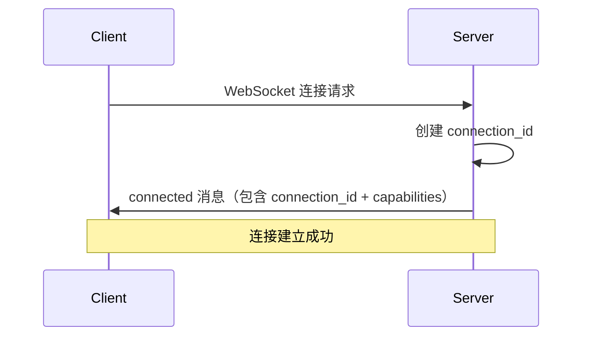
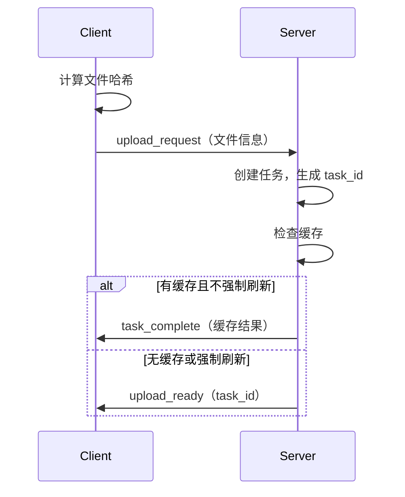
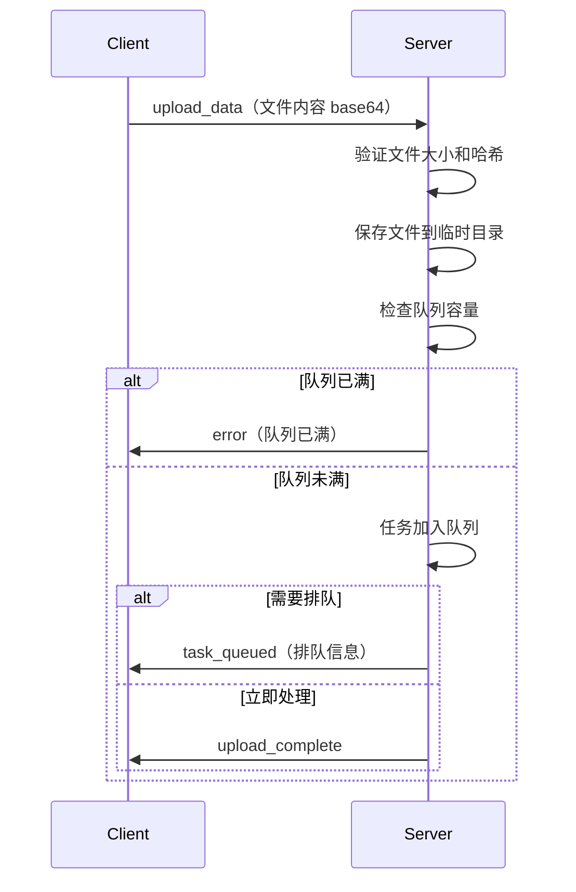
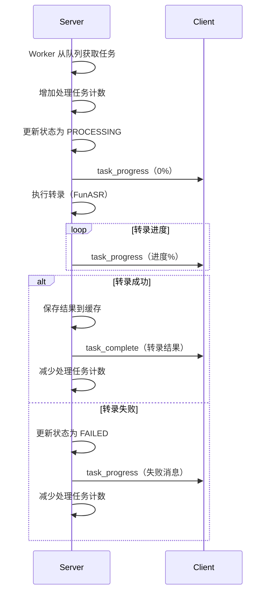
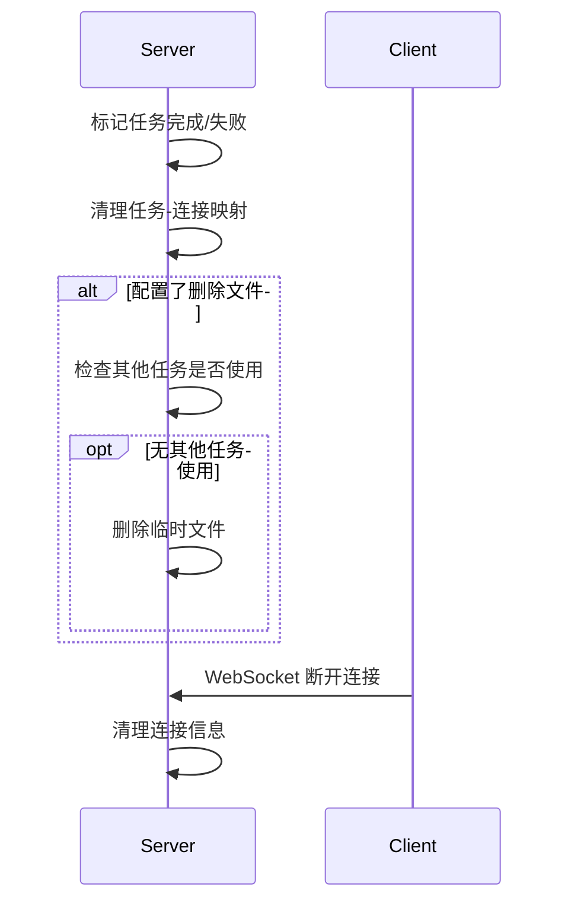

# Server-Client 交互流程文档

## 概述

本文档详细说明多引擎转录服务器与客户端之间的 WebSocket 交互流程，包括能力协商、术语提示、任务开始、处理和结束的完整控制机制。

## 能力契约与 fail-closed

服务端提供只读 HTTP `GET /capabilities`，响应只包含 `schema_version`、当前 `engine`、有效 `runtime`、`features.terms` 和由这些字段计算的 `capability_id`。当前 FunASR 与 Qwen3 都声明 `features.terms: true`。WebSocket `connected` payload 的 `capabilities` 必须复用同一对象；客户端应比较两处 `capability_id`（最好比较完整对象），缺字段或不一致即 fail-closed，不发送术语请求。

```json
{
  "schema_version": 1,
  "engine": "funasr",
  "runtime": "mac_ane",
  "features": {"terms": true},
  "capability_id": "<sha256-of-canonical-capability-fields>"
}
```

`capability_id` 不是任务 ID，也不携带路径、token 或模型诊断信息；客户端不应自行猜测或拼接它。

## 核心组件

### Server 端
- **WebSocketHandler** (`src/api/websocket_handler.py`): 管理 WebSocket 连接和消息路由
- **TaskManager** (`src/core/task_manager.py`): 管理任务队列和生命周期

### Client 端
- **WebSocket 客户端**: 负责连接服务器、发送文件、接收结果

## 交互流程

### 1. 连接建立阶段



`connected.data` 至少包含 `connection_id`、`message`、`server_time`、`capabilities`；其中 `capabilities` 与 HTTP `/capabilities` 完全相同。

**关键代码位置**：
- Server: `websocket_handler.py:25-46` (handle_connection)
- Client: `test_server_transcription.py:39-66` (connect_to_server)

### 2. 任务创建阶段



**关键代码位置**：
- Client 发送请求: `test_server_transcription.py:152-164`
- Server 处理请求: `websocket_handler.py:142-213` (_handle_upload_request)
- Server 创建任务: `task_manager.py:55-76` (create_task)

#### 2.1 ASR 引擎选择 (`engine` 字段)

`upload_request` 可携带可选字段 `engine`,取值 `"funasr"` 或 `"qwen3"`；实际是否可用以 `/capabilities` 的 `engine` 为准:

```json
{
  "type": "upload_request",
  "data": {
    "file_name": "x.wav",
    "file_hash": "sha256:...",
    "file_size": 1234567,
    "engine": "qwen3"           // 可选, 缺省走 server 默认
  }
}
```

**优先级**: `request.engine` > `config.transcription.default_engine` (env `FUNASR_DEFAULT_ENGINE`) > `"funasr"`。

**缓存隔离**: 缓存 key 已按 `(file_hash, engine)` 联合区分 — 同一份文件在不同引擎下的转录结果**互不命中**,可并存。

**引擎能力**:
- `funasr`: 生产稳定路径, MPS GPU 加速, 支持说话人识别
- `qwen3`: Linux CUDA 支持路径（也可在 Mac 按需切换），通过 runtime-aware pool 接入；详见 `CLAUDE.md` ASR 引擎章节

#### 2.2 术语 `terms`（单文件与分片共用）

`upload_request.data.terms` 为可选字符串数组。它是唯一客户端可传的术语输入；不接受任意 prompt 或 `context` 字段。服务端按 NFKC → trim → 折叠连续空白 → 稳定去重（保首次顺序）规范化；空数组/省略字段等价于无术语。

限额是协议的一部分：原始最多 100 项、单项最多 256 字符；规范化后最多 50 项、单项最多 64 字符、生效术语总长度最多 1024。字符串数组触发限额时返回 `type: "error"`、`data.error: "invalid_terms"`，同级 `data.reason` 为 `too_many_raw_items`、`raw_item_too_long`、`too_many_terms`、`term_too_long` 或 `total_too_long`；其他类型错误返回 `upload_error`。原始术语不回显。

FunASR 将生效术语作为 hotword 传给模型；Qwen3 将它们作为服务端控制的 context 输入。两者都在响应 metadata 中以 `terms_count` 回显生效数量，并在实际应用时回显 `context_applied: true`。空 terms 零影响，且可正常使用普通缓存；有一个或多个有效 terms 时绕过普通缓存读取并重新转录。

单文件 authority：术语只在 `upload_request` 校验并绑定任务；`upload_data` 不重复携带。分片 authority：术语只在创建 session 时校验并保存；`upload_chunk` 不得携带或覆盖，`finalize_upload` 只接受原 `task_id`，不得改术语。`queue_full` 后重试 finalize 不重传分片。

### 3. 文件上传阶段



**关键代码位置**：
- Client 上传数据: `test_server_transcription.py:189-198`
- Server 处理上传: `websocket_handler.py:215-266` (_handle_upload_data)
- Server 提交任务: `task_manager.py:82-126` (submit_task)

### 4. 任务处理阶段



**关键代码位置**：
- Worker 处理: `task_manager.py:157-177` (_worker)
- 任务执行: `task_manager.py:179-312` (_process_task)
- 进度通知: `websocket_handler.py:310-345` (notify_task_progress)
- 完成通知: `websocket_handler.py:347-369` (notify_task_complete)

### 5. 任务结束与清理



**关键代码位置**：
- 任务完成处理: `task_manager.py:241-264`
- 连接清理: `websocket_handler.py:381-393` (_cleanup_connection)
- 文件清理: `task_manager.py:248-262`

## 任务状态管理

### 任务状态流转

```
PENDING（待处理） -> PROCESSING（处理中） -> COMPLETED（完成）
                                      \-> FAILED（失败）
                                      \-> CANCELLED（取消）
```

### 状态控制点

1. **任务创建时**：状态设为 PENDING
2. **开始处理时**：状态设为 PROCESSING
3. **处理完成时**：状态设为 COMPLETED
4. **处理失败时**：状态设为 FAILED
5. **用户取消时**：状态设为 CANCELLED

## 并发控制机制

### 1. 任务队列管理

- 使用 `asyncio.Queue(maxsize=150)` 管理待处理任务；这是 `config.json` 的显式值，profile/env 可按优先级覆盖
- 配置 `max_concurrent_tasks=2` 控制 FunASR 并发数；Qwen3 另由 `qwen3_pool_size` 控制
- 配置 `max_queue_size=150` 限制队列最大长度；队列是准入控制，不是无限缓冲池
- Worker 线程池并发处理任务
- 实现排队状态通知和预估等待时间

### 2. 文件生命周期管理

- **文件去重**：基于文件哈希避免重复上传
- **引用计数**：多任务共享同一文件时，等所有任务完成后才删除
- **缓存策略**：相同文件直接返回缓存结果

**关键实现**：
```python
# task_manager.py:249-262
has_pending_tasks = any(
    t.file_hash == task.file_hash and 
    t.status in [TaskStatus.PENDING, TaskStatus.PROCESSING]
    for t in self.tasks.values()
    if t.task_id != task.task_id
)
if not has_pending_tasks:
    await delete_file(task.file_path)
```

### 3. 连接管理

- **连接映射**：维护 connection_id -> websocket 映射
- **任务关联**：维护 task_id -> connection_ids 映射
- **断线处理**：自动清理断开的连接
- **连接限制**：默认最大支持100个并发连接（`config.json` 显式值）
- **心跳机制**：60秒间隔心跳检测
- **超时控制**：5分钟连接超时

## 错误处理与重试

### 1. 可重试错误

- VAD 算法错误
- 索引越界错误
- 模型临时错误

### 2. 不可重试错误

- 音频时长过短
- 文件不存在
- 文件格式不支持
- 认证失败

### 3. 重试机制

```python
# task_manager.py:279-290
if should_retry and task.retry_count < config.transcription.retry_times:
    task.retry_count += 1
    task.status = TaskStatus.PENDING
    await self.task_queue.put(task_id)
```

## 并发优化特性

### 1. 队列状态通知

当任务需要排队时，服务器会发送 `task_queued` 消息：

```json
{
  "type": "task_queued",
  "data": {
    "task_id": "xxx",
    "queue_position": 15,
    "estimated_wait_seconds": 1350,
    "message": "文件上传成功，排队位置: 15"
  }
}
```

### 1.5 异步轮询契约（TODOS #20，2026-06-16 服务端落地）

**背景**：pool=1（真实并发=1）时深队列后段任务 `k×T` 才完成，客户端同步堵 `recv()` 的 300s 窗注定等不到 → 误判超时。根治办法是**客户端收 ack 后改轮询，不堵等**。

**服务端零上传协议改动**：入队后服务端**今天就**回 `task_queued`/`upload_complete`（带 `task_id`/`queue_position`/`estimated_wait_seconds`）。客户端在此 ack 后转入轮询循环即可，服务端无需知情——**无 `wait` 开关、无 `task_accepted` 新消息**。

**新增消息 `task_status_batch`（批量查询，防 N+1 拉取风暴 + TTL race）**：

请求（`task_ids` 上限 50，超出服务端截断 + warn）：
```json
{ "type": "task_status_batch", "data": { "task_ids": ["id1", "id2", ...] } }
```

响应（逐 id 项）：
```json
{
  "type": "task_status_batch",
  "data": {
    "items": [
      { "task_id": "id1", "status": "processing", "progress": 42.0, "result": null, "srt_content": null, "error": null },
      { "task_id": "id2", "status": "completed", "progress": 100.0, "result": { /* TranscriptionResult */ } },
      { "task_id": "id3", "status": "completed", "srt_content": "1\n00:00:..." },
      { "task_id": "id4", "status": "failed", "error": "..." },
      { "task_id": "id5", "status": null, "error": "task_expired" },
      { "task_id": "id6", "status": null, "error": "task_not_found" }
    ]
  }
}
```

逐 id 语义：
- **COMPLETED**：JSON 内联 `result`，**SRT 内联 `srt_content`**（`result` 装不下 SRT 文本）。
- **终态全集** `completed/failed/timed_out/cancelled` 都带终态 + `error`，客户端据此**停轮询**（不能只认 completed，否则失败任务无限轮询）。
- **PENDING/PROCESSING** → `result/srt_content/error` 全 null（小帧）。
- **poll-miss**：`status=null` + `error="task_expired"`（曾存在被内存清理）或 `"task_not_found"`（从未存在）；客户端凭 `file_hash` 重投（命中 DB 缓存秒回；分片重启需重传）。

**客户端硬约束**：批量场景**必须**用单条 `task_status_batch`（禁 per-task 各自轮询）；用 ack 的 `estimated_wait` 定首延、间隔退避（如 5~10s）；完成项 result 随 batch 内联拿到，不再单查。

**关键代码位置**：
- 路由 + 批量 handler：`websocket_handler.py:_handle_task_status_batch` + `_build_task_status_batch_item`（**同步组装、中间不 await**，钉 `task_manager.py` COMPLETED 翻转原子性，避免返回 completed+null）
- schema：`schemas.py:TaskStatusBatchResponse` / `TaskStatusBatchItem`

详见 `docs/开发/2026-06-16-异步轮询契约-设计定案与落地计划.md`。

### 2. 动态负载均衡

- 支持运行时调整并发任务数
- 基于系统资源动态扩缩容
- 智能队列管理防止资源耗尽

### 3. 队列容量保护

- 队列满时拒绝新任务
- 防止内存溢出和系统崩溃
- 提供明确的错误信息

### 4. 统计信息增强

```python
# task_manager.get_stats() 返回信息
{
    "total_tasks": 100,
    "pending_tasks": 10,
    "processing_tasks": 8,
    "completed_tasks": 80,
    "failed_tasks": 2,
    "cancelled_tasks": 0,
    "queue_size": 10,
    "max_queue_size": 50,
    "max_concurrent_tasks": 8
}
```

## 客户端多进程释放建议

基于以上分析，客户端实现多进程释放需要注意：

### 1. 连接管理
- 每个进程独立维护 WebSocket 连接
- 避免跨进程共享 WebSocket 对象

### 2. 任务分配
- 主进程分配文件到各工作进程
- 工作进程独立完成上传和接收结果

### 3. 资源释放时机
- **任务完成后**：收到 `task_complete` 消息
- **任务失败后**：收到 `task_progress` 的失败状态
- **连接断开时**：WebSocket 异常或主动断开

### 4. 进程间通信
- 使用队列传递任务和结果
- 主进程汇总所有工作进程的结果

### 5. 异常处理
- 工作进程异常不影响其他进程
- 实现进程级别的重试机制

### 6. 客户端并发控制
- 根据服务器配置设置客户端并发数
- 监听 `task_queued` 消息调整发送频率
- 实现客户端侧限流避免服务器过载

## 示例代码结构

```python
# 多进程客户端示例结构（优化版）
class MultiProcessClient:
    def __init__(self, num_workers=4, max_queue_size=20):
        self.task_queue = multiprocessing.Queue(maxsize=max_queue_size)
        self.result_queue = multiprocessing.Queue()
        self.workers = []
        self.server_stats = None
        self.last_stats_time = 0
    
    async def check_server_load(self):
        """检查服务器负载"""
        current_time = time.time()
        if current_time - self.last_stats_time > 30:  # 30秒检查一次
            # 从服务器获取统计信息
            stats = await self.get_server_stats()
            if stats:
                queue_usage = stats['queue_size'] / stats['max_queue_size']
                if queue_usage > 0.8:  # 队列使用率超过80%
                    await asyncio.sleep(10)  # 延迟发送新任务
            self.last_stats_time = current_time
    
    def worker_process(self):
        """工作进程"""
        client = WebSocketClient()
        client.connect()
        
        while True:
            task = self.task_queue.get()
            if task is None:
                break
                
            try:
                result = client.process_file(task)
                
                # 处理排队响应
                if result.get('queued'):
                    print(f"任务排队: 位置 {result['queue_position']}, 预估等待 {result['estimated_wait']} 秒")
                
                self.result_queue.put(result)
                
            except Exception as e:
                if "队列已满" in str(e):
                    print("服务器队列已满，等待后重试...")
                    time.sleep(30)  # 等待30秒后重试
                    self.task_queue.put(task)  # 重新加入队列
                else:
                    self.result_queue.put({"error": str(e)})
            finally:
                # 确保释放资源
                client.cleanup_task(task)
        
        client.disconnect()
    
    def cleanup_task(self, task):
        """清理任务资源"""
        # 释放文件句柄
        # 清理临时文件
        # 重置任务状态
        pass
    
    async def submit_with_backoff(self, task):
        """带退避策略的任务提交"""
        retry_count = 0
        max_retries = 3
        
        while retry_count < max_retries:
            try:
                await self.check_server_load()
                self.task_queue.put_nowait(task)
                return True
            except queue.Full:
                retry_count += 1
                wait_time = 2 ** retry_count  # 指数退避
                print(f"客户端队列已满，等待 {wait_time} 秒后重试...")
                await asyncio.sleep(wait_time)
        
        return False
```

## 注意事项

1. **心跳机制**：客户端使用 ping/pong 保持连接活跃（30秒间隔）
2. **超时控制**：长时间任务需要合理设置超时（默认5分钟）
3. **消息大小**：大文件传输需要设置合适的 max_size
4. **并发限制**：根据服务器配置控制客户端并发数（建议不超过8）
5. **队列监控**：客户端应监听队列状态，避免在服务器繁忙时过度提交
6. **资源清理**：及时处理 `task_complete` 和 `task_queued` 消息，释放客户端资源
7. **错误处理**：正确处理队列满错误，实现客户端重试机制

## 最佳实践配置

基于16核CPU的推荐配置：

```json
{
  "server": {
    "max_connections": 200,
    "connection_timeout_seconds": 300,
    "heartbeat_interval_seconds": 30
  },
  "transcription": {
    "max_concurrent_tasks": 8,
    "max_queue_size": 50,
    "queue_status_enabled": true
  }
}
```

## 性能监控

使用 `task_manager.get_stats()` 监控系统负载：
- 队列长度超过80%时暂停接收新任务
- 处理任务数接近上限时启用限流
- 失败任务比例过高时检查系统状态
